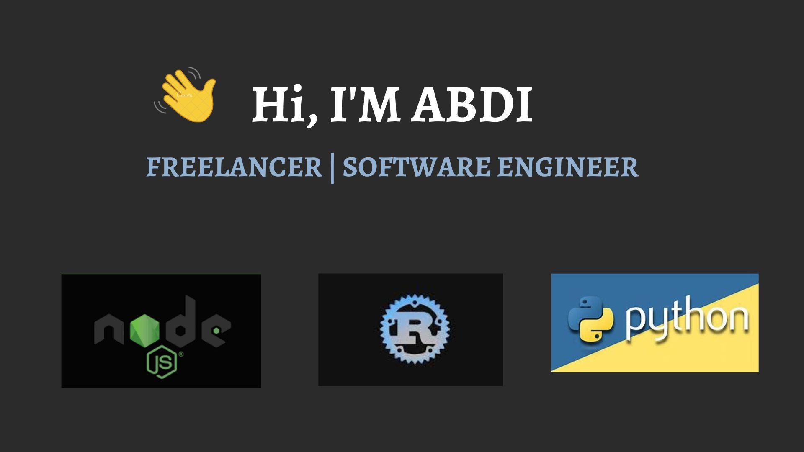

  

 

<h1> Things I code with</h1>

  
  
  
  
  
  
  
  
  
  
  
  
  
  
  
  
  
  
  
  
  
  

<h1>About Me</h1>

Hi there, my name is **Abdi Urgessa** and I'm a full-stack developer with a passion for building `high-performance`, `secure`, and `user-friendly` applications. With several years of experience in the industry, I've had the pleasure of working on a variety of projects ranging from small-scale startups to enterprise-level applications.

I specialize in developing `microservices` architecture and I have a deep understanding of backend technologies such as `Rust` and `Node.js`. I believe in writing `clean`, `scalable` code that is easy to maintain and helps to reduce technical debt.

In addition to my technical skills, I am also experienced in `project management` using `Scrum` and `agile` methodologies. I enjoy working with teams to define project requirements, establish milestones, and ensure timely delivery of high-quality software.

When it comes to frontend development, I am proficient in using popular frameworks like `React`, `Vue`, and `Angular` to create responsive and visually appealing user interfaces. I am always looking for new challenges and opportunities to learn, and I am excited to continue growing my skills as a developer.

Feel free to connect with me on LinkedIn to learn more about my work.
